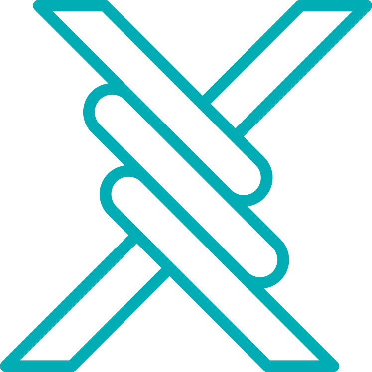

<p align="center">
  <a href="https://github.com/MehrWizard/Marzdar" target="_blank" rel="noopener noreferrer">
    <picture>
      <source media="(prefers-color-scheme: dark)" srcset="docs/assets/logo-dark.svg">
      
    </picture>
  </a>
</p>

<h1 align="center">Marzdar</h1>

<p align="center">
  基于 <a href="https://github.com/gozargah/marzban">Marzban</a> 现有 API 能力、致力于补全网页管理界面的 100% 兼容无缝替代分支。
</p>

<p align="center">
  <a href="https://github.com/MehrWizard/Marzdar/actions/workflows/build.yml">
    
  </a>
  <a href="https://hub.docker.com/r/mehrwizard/marzdar" target="_blank">
    
  </a>
  <a href="https://github.com/MehrWizard/Marzdar/stargazers">
    
  </a>
  <a href="./LICENSE">
    
  </a>
  <a href="https://t.me/MehrRoom" target="_blank">
    
  </a>
  <a href="https://x.com/MehrWizard" target="_blank">
    
  </a>
</p>

<p align="center">
  <a href="./README.md">English</a>
  /
  <a href="./README-fa.md">فارسی</a>
  /
  <a href="./README-zh-cn.md">简体中文</a>
  /
  <a href="./README-ru.md">Русский</a>
</p>

<p align="center">
  <a href="https://github.com/MehrWizard/Marzdar" target="_blank" rel="noopener noreferrer">
    
  </a>
</p>

---

## 什么是 Marzdar？

**Marzdar** 是 [Marzban](https://github.com/gozargah/marzban) 的无缝直接替代版本。

原始的 Marzban 在后端已经实现了许多强大的 REST API 接口与数据库功能，但在前端面板中一直缺乏对应的按钮与控制界面。**Marzdar 旨在补全这部分用户界面**，在不破坏任何兼容性与核心架构的前提下，让用户能直接在网页中使用所有后端能力。

---

## Marzban 对比 Marzdar

| 功能模块 | Marzban (原版) | Marzdar |
| :--- | :--- | :--- |
| **兼容性** | 标准 Marzban | 100% 无缝兼容（完全相同的数据库、CLI 与核心） |
| **管理员管理** | 仅限 CLI / API | 完整网页 UI（创建、编辑、删除、Sudo、用量统计及重置） |
| **用户模板** | 仅限 API | 完整网页 UI（模板管理 + 创建用户时一键自动预填） |
| **续费排队计划 (Next Plan)** | 仅限 API (`next_plan`) | 完整网页 UI（配置排队计划 + 支持一键立即生效） |
| **清理到期用户** | 手动 SQL / API | 安全且支持按时间范围筛选的批量清理弹窗 |
| **转移用户所有权** | 仅限 API | 网页端管理员之间直接转移用户归属 |
| **主题与配色** | 固定浅色 / 深色 | 浅色、深色及纯黑 OLED 模式 + 8 种强调配色方案 |
| **版本迁移** | - | 仅需修改 Docker 镜像名称单行配置 |

---

## 项目范畴与定位

### ✅ Marzdar 致力于实现的
- **补全网页用户界面**：为后端已具备的 API 接口提供优雅、清晰的可视化操作组件。
- **保持 100% 互换性**：绝不引入破坏数据库结构、环境配置或命令行工具的变更。随时可以在 Marzban 与 Marzdar 之间无缝切换。
- **优化 UI/UX 体验**：提供现代主题（浅色、深色、纯黑 OLED）、强调色调色板，并保持英语、波斯语、俄语与中文的完整本地化对齐。

### ❌ 不在计划范围内（非本项目范畴）
- **绝不破坏后端架构**：不重构后端核心引擎或篡改基础数据库表结构。
- **不增加不兼容协议**：遵循标准 Xray-core 及 Marzban 协议体系规范。
- **杜绝冗余臃肿功能**：任何偏离 Marzban 初衷或影响互换性的特性都不会被接纳。

---

## 安装与迁移配置

在安装原版 Marzban 后，仅需将 `docker-compose.yml` 中的镜像替换为 Marzdar：

原配置：
```yaml
services:  
  marzban:  
    image: gozargah/marzban:latest
```

替换为：
```yaml
services:  
  marzban:  
    image: mehrwizard/marzdar:latest
```

最后执行 `marzban update` 即可完成 `marzdar` 的配置升级：
```bash
marzban update
```

---

## 赞助支持 (Donation)

如果您觉得 Marzdar 对您有所帮助并希望支持项目的持续开发：

- [通过 MehrNet 支付网关赞助](https://gateway.mehrnet.com/product/1DE5C11019E2)

---

## 开源协议

Marzdar 遵循 [GNU Affero General Public License v3.0 (AGPL-3.0)](./LICENSE) 开源协议。
